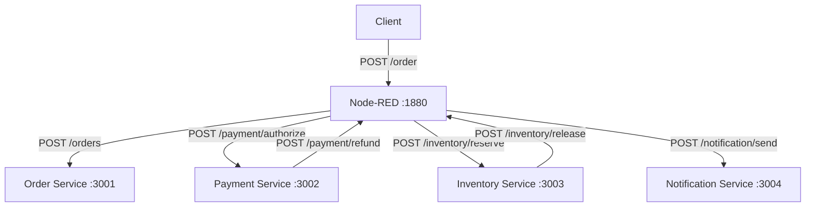
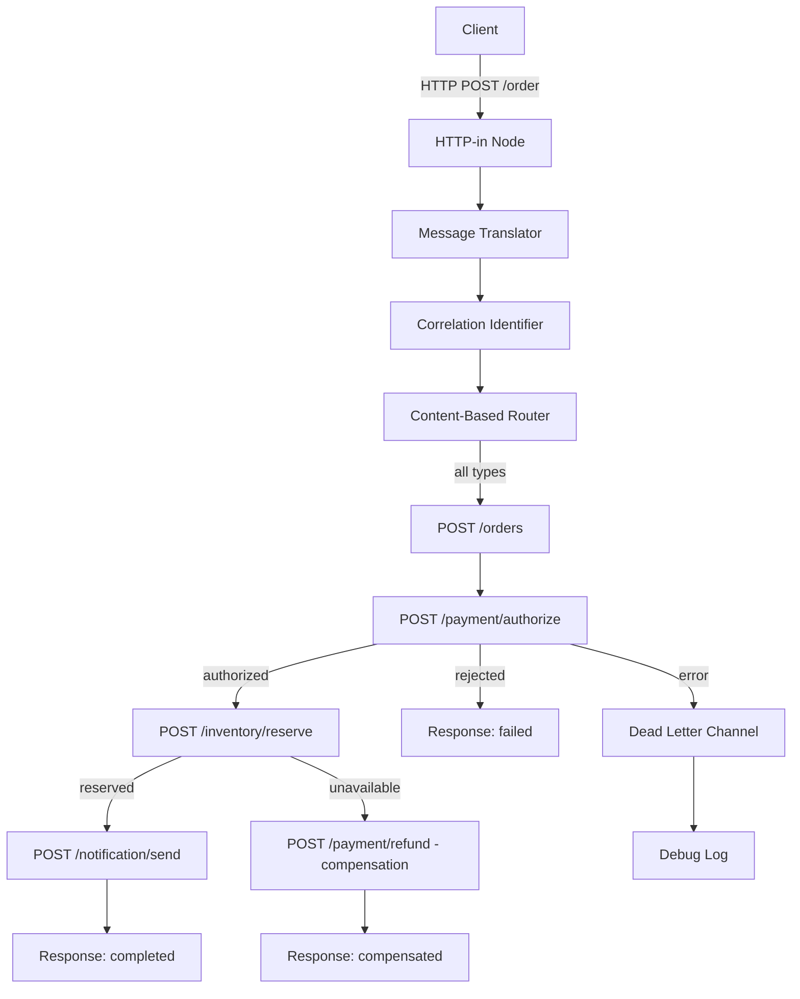
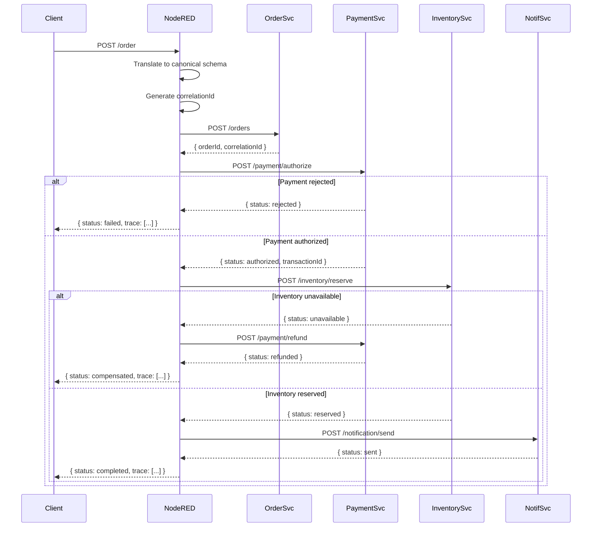

# Capstone: Orchestrated Enterprise Application Integration System

**Student:** Oļegs Bērziņš  
**Course:** Enterprise Application Integration (EAI)  
**Deadline:** 10.04.2026

---

## Architecture Decision

I chose Option A — Node-RED as the entry point. The client sends the order directly to Node-RED, which then calls the Order Service to create a record, and continues to orchestrate Payment, Inventory, and Notification in sequence. This made more sense to me because the orchestration logic naturally lives in the integration layer, not in a business service. Putting it in the Order Service would mean that service knows too much about the overall process, which breaks separation of concerns. Node-RED is designed for this kind of workflow, so it was the cleaner choice.

---

## System Context Diagram

---

## Integration Architecture Diagram

---

## Orchestration Flow

---

## EIP Pattern Mapping Table

| Pattern | Problem It Solves | Where Applied | Why Chosen |
|---|---|---|---|
| Content-Based Router | Different order types (web, mobile, b2b) need different routing paths | Switch node after Message Translator, routes by `orderType` | The system receives orders from multiple sources in different formats, so routing based on content was the natural fit |
| Correlation Identifier | Without a shared ID it's impossible to trace one order across four services | Generated once in Node-RED at the start, passed in every request body and `x-correlation-id` header | Core requirement for any multi-step process — without it logs from different services are disconnected |
| Dead Letter Channel | Unrecoverable errors would silently disappear | Catch node in Error Handling tab routes failed messages to a debug log | Guarantees that no failure goes unnoticed, even if compensation itself fails |
| Message Translator | Three different input formats (web JSON, mobile abbreviated JSON, B2B XML) need to become one canonical structure | Function node at the start of the Orchestration flow, converts all formats to canonical schema | Without this, every downstream service would need to handle multiple formats |

---

## Failure Analysis

### Scenario 1 — Payment Rejection

To reproduce: set `PAYMENT_FAIL_MODE: always` in docker-compose.yml and restart payment-service.

What happens: Node-RED calls `/payment/authorize`, receives `status: rejected`. The switch node routes to the failure path. Inventory and Notification are never called. The response returns `status: failed` with a trace showing the rejected payment step.

Final state: order record exists in Order Service with no payment, no reservation, no notification. No compensation needed because nothing succeeded before the failure.

### Scenario 2 — Inventory Unavailable (with compensation)

To reproduce: set `INVENTORY_FAIL_MODE: always` in docker-compose.yml and restart inventory-service.

What happens: Payment authorizes successfully. Node-RED calls `/inventory/reserve`, receives `status: unavailable`. Compensation starts immediately — Node-RED calls `/payment/refund` with the transactionId from the earlier step. After refund succeeds, the response returns `status: compensated` with the full trace including `compensation:payment-refund`.

Final state: payment was authorized and then refunded. No reservation was made. No notification was sent. The system is back to a clean state.

---

## AI Usage Disclosure

I used Claude (Anthropic) during this project. It helped me scaffold the three service files (order, payment, inventory) and the Node-RED flows.json. I reviewed all the generated code, fixed issues that came up during testing (wrong file in wrong service, uuid require not working in Node-RED function nodes), and ran both failure scenarios manually to verify the compensation logic works correctly. I understand how the correlationId flows through the system, how the switch nodes create the Content-Based Router, and why compensation has to run in reverse order.
